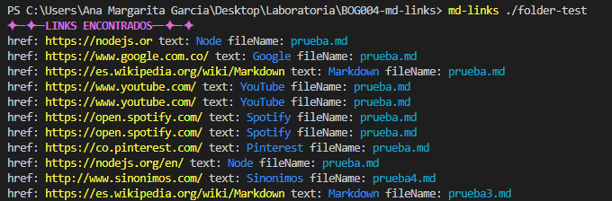
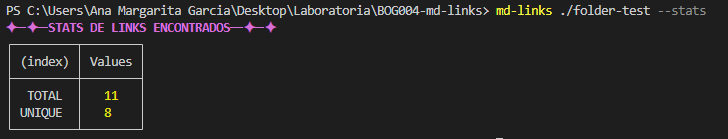
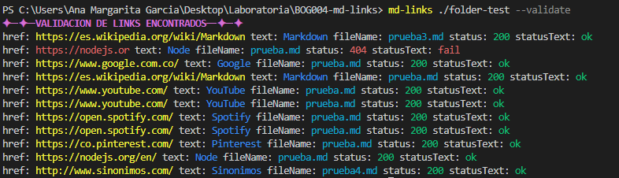
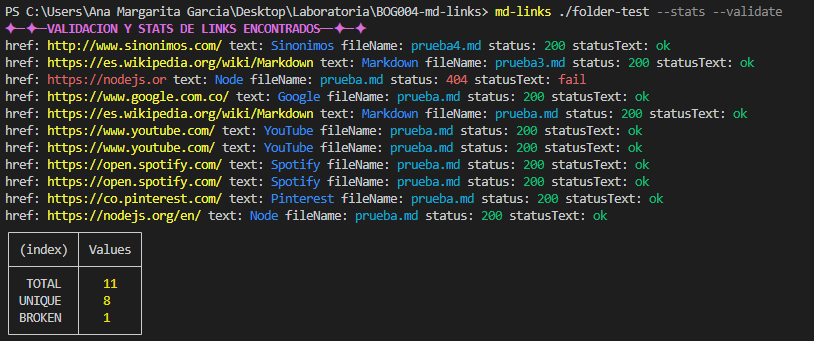
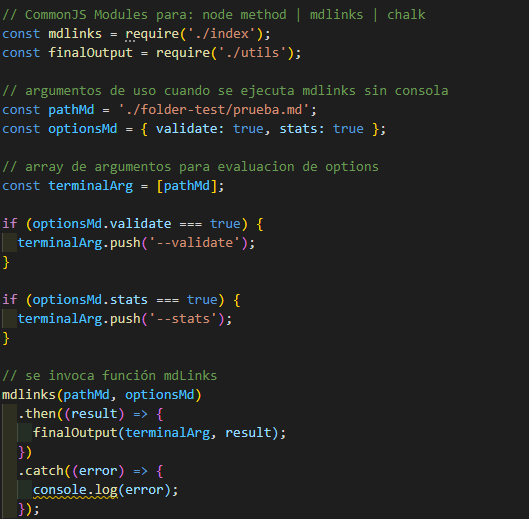
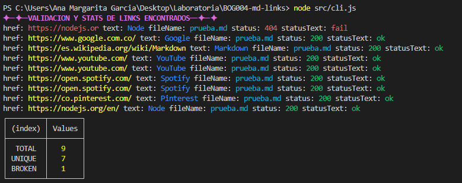

# Markdown Links &#127808;

Esta librería sirve para devolver los enlaces o direcciones URL contenidos en una carpeta en la cual haya archivos de extensión .md o directamente un archivo de extensión .md; con esta información es posible conocer las estadísticas sobre: 

- total de links.
- links únicos. 
- links rotos.

## 1. Instalación &#127808;

Ejecutar en la terminal el comando

- npm install md-links-anagarcia791

## 2. Guia de uso &#127808;

### 2.1 Ejecución en terminal

Esta aplicación se puede ejecutar a través de la terminal con la siguiente estructura:

Solo con el path: `md-links <ruta>` 

Path con opción de estadísticas: `md-links <ruta> --stats`

Path con opción de validación: `md-links <ruta> --validate`

Path con opción de validación y estadísticas: `md-links <ruta> --validate --stats` o `md-links <ruta> --stats --validate`

### 2.2 Ejecución de función

En el archivo que se requiera extraer la información se puede estructurar de la siguiente manera:

Resultado: 

## 3. Autora &#127808;

Ana Margarita Garcia &#128125;